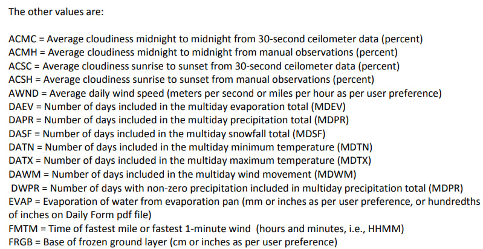

# Лабораторные работы

## Навигация по работам

[Анализ и прогнозирование климатических изменений с использованием методов искусственного интеллекта](#laboratory-work-1)

[Извлечение ключевых слов из текста: сравнение методов на основе статистики и машинного обучения](#laboratory-work-2)

[Исследование возможностей генерации текста с помощью рекуррентных нейронных сетей с учетом контекста](#laboratory-work-3)

## Анализ и прогнозирование климатических изменений с использованием методов искусственного интеллекта <a href="#laboratory-work-1"></a>

[](https://colab.research.google.com/drive/1rCXgNbDGgrqX6bAXGgkaKzdfdX09_kvN#scrollTo=yJ1cnLtcjf5U)

### Принцип работы

Проект представляет собой модель машинного обучения для предсказания максимальной температуры c использованием метода Ridge регрессии.

Модель разработана для анализа данных о погоде в определенном месторасположении и предсказания возможных изменений в максимальной температуре в этом регионе. Путем ввода разнообразных погодных параметров, таких как влажность, давление, скорость ветра и другие, модель стремится выявить взаимосвязи и тенденции, которые могут влиять на максимальную температуру.

Помимо предсказания значений максимальной температуры, модель также может быть дополнительно настроена для выявления ключевых факторов, оказывающих влияние на погодные изменения в регионе.

Для обучения модели я использовал данные проекта [GNCNd](https://www.ncei.noaa.gov/products/land-based-station/global-historical-climatology-network-daily). Документация к данным доступна по [ссылке](https://www.ncei.noaa.gov/pub/data/cdo/documentation/GHCND_documentation.pdf).




## Извлечение ключевых слов из текста: сравнение методов на основе статистики и машинного обучения <a href="#laboratory-work-2"></a>

[](https://colab.research.google.com/drive/1MG6T7wXeavZjV1u88ApgUcEQ-SJbfC_S?usp=sharing)

### Установка

Запустите скрипт:

```sh
pip install jupyter
pip install nbconvert
```

```sh
jupyter nbconvert --to notebook --execute weather.ipynb
```

### Принцип работы

В качестве примера я использовал метод **TF-IDF** и **LDA**.

**TF-IDF:** Измеряет, насколько часто слово встречается в документе. Оценивает, насколько уникальным является слово в контексте коллекции документов. Высокие значения TF-IDF указывают на важные слова в конкретном документе по сравнению с остальными документами коллекции.

**Latent Dirichlet Allocation (LDA):** Это вероятностная модель, используемая для выявления тем в коллекции текстов. LDA предполагает, что каждый документ может быть представлен как смесь различных тем, а каждая тема может быть представлена как смесь различных слов. Модель основывается на предположении, что слова в документе связаны с его темой.

### Установка

Установите зависимости:

```sh
pip install -r requirements.txt
```

Запустите скрипт:

```sh
pip install jupyter
pip install nbconvert
```

```sh
jupyter nbconvert --to notebook --execute keywords_extracting_based_on_TF_IDF_and_LDA.ipynb
```

### Использование

По умолчанию, шумовые слова удаляются на английском языке. Если вы хотите использовать текст, написанный на другом языке, замените английский язык на предпочитаемый.

```python
stop_words = set(stopwords.words('english'))
```

Замените текст внутри тройных кавычек (`"""`) на ваш собственный текст, из которого вы хотите извлекать ключевые слова.

```python
input_text = """
Это пример текста, из которого будут извлекаться ключевые слова. Вы можете изменить этот текст на свой собственный.
"""
```

## Извлечение ключевых слов из текста: сравнение методов на основе статистики и машинного обучения <a href="#laboratory-work-2"></a>

[](https://www.kaggle.com/code/guiltyaxeil/text-generator-using-lstm)

### Принцип работы

В качестве входных данных используются новостные заголовки [New York Times](https://www.kaggle.com/datasets/aashita/nyt-comments).

После этапа подготовки данных модель LSTM принимает на вход векторизованные последовательности токенов и обучается выявлять зависимости между словами. LSTM (Long Short-Term Memory).

После завершения обучения модель становится способной генерировать новые текстовые последовательности на основе введенного начального текста. Это достигается передачей начальной последовательности токенов через обученную модель, которая затем предсказывает следующий токен. Этот процесс может быть повторен для генерации более длинных текстовых последовательностей.

### Использование

Запустить модель с предустановленными данными можно по [ссылке](https://www.kaggle.com/code/guiltyaxeil/text-generator-using-lstm) в связи с необходимостью обработки больших объемов входных данных.

В качестве аргуметра `seed_text` ожидает предложение которое ему предстоит дописать.

```python
generated_text = generate_text(model, token, max_sequence_len, seed_text = "The crypto is going to")
print("Generated text: ", generated_text)
```

**Замечание:** вы можете улучшить выдачу модели изменив архитектуру, увеличением колличества эпох или оптимизировав параметры для лучшей сходимости.
